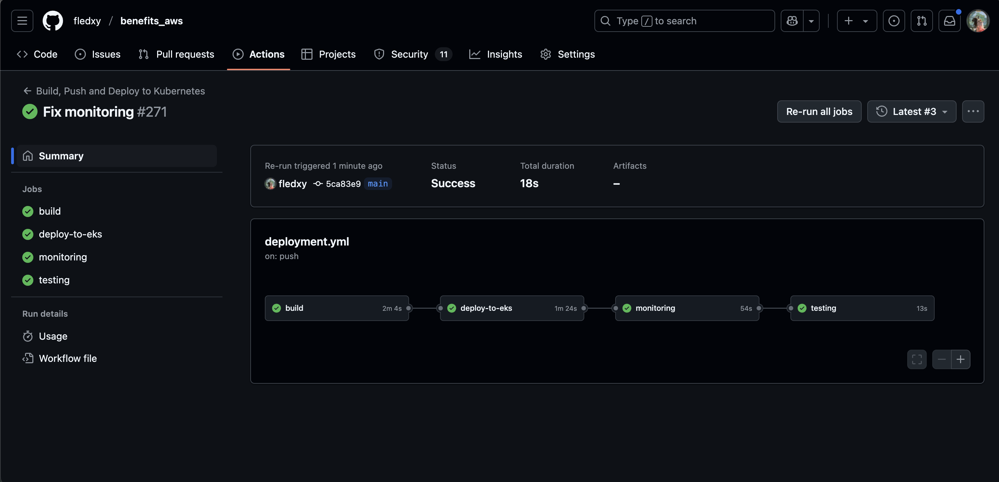
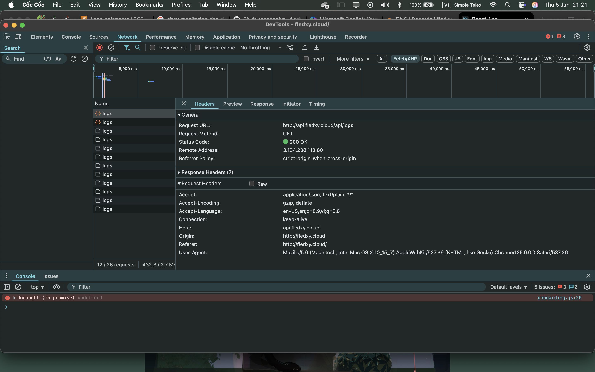
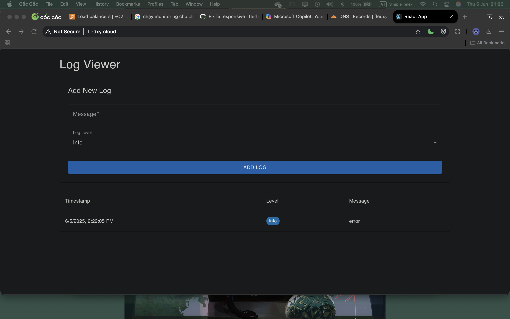
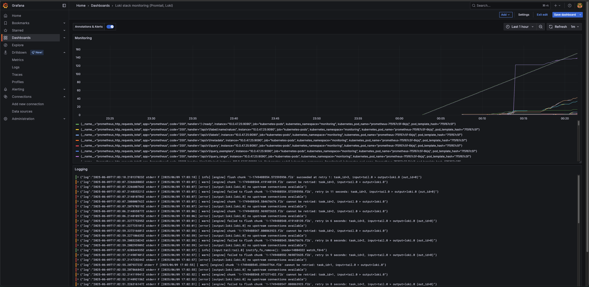
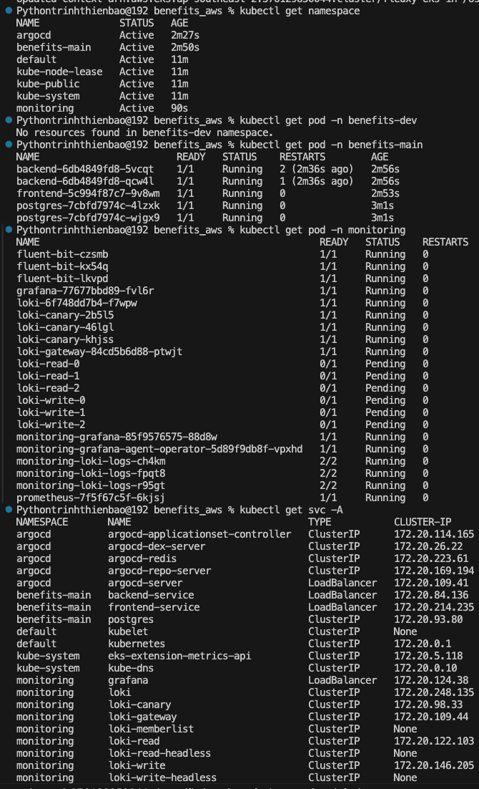
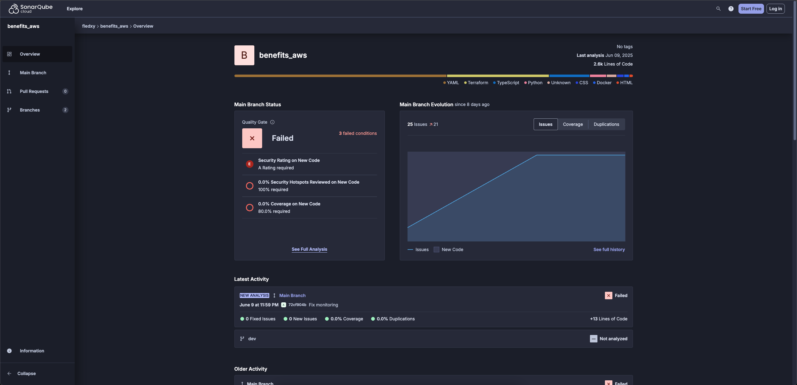
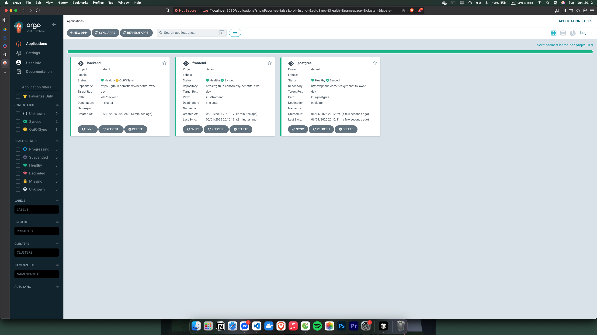

# DevOps Documentation

## Project Overview
Benefits_aws is a modern application built on AWS EKS

## CI/CD Pipeline

CI/CD pipeline consists of two main stages:
1. **Build Stage**
   - Builds Docker images for both frontend and backend services
   - Pushes images to private Docker Hub repository

2. **Deploy Stage**
   - Updates Kubernetes manifests
   - Deploys to EKS cluster using ArgoCD

## Infrastructure Architecture

### Backend Architecture

### Frontend Architecture

## Monitoring & Observability

Our monitoring stack includes:
- Prometheus for metrics collection
- Grafana for visualization
- Loki for logging

## EKS Deployment

## Code Quality & Security

## ArgoCD Integration

## Getting Started

1. Clone the repository
2. Set up your AWS credentials
3. Configure Kubernetes context to your EKS cluster
4. Run `helm install` for the required components

## Prerequisites
- AWS account with appropriate permissions
- EKS cluster
- Docker Hub account
- SonarCloud account
- Required AWS services (RDS, S3, etc.)

## Contributing
1. Fork the repository
2. Create a feature branch
3. Commit your changes
4. Push to the branch
5. Create a Pull Request
